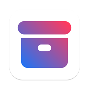
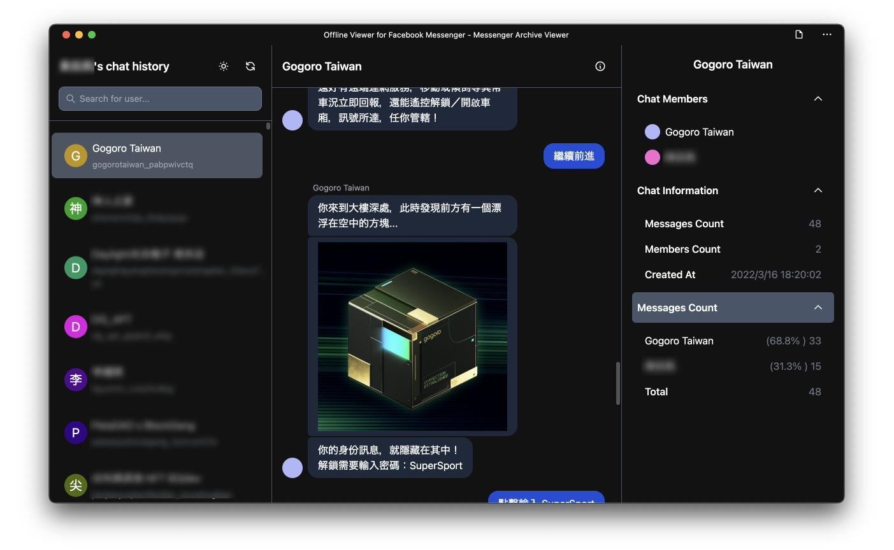
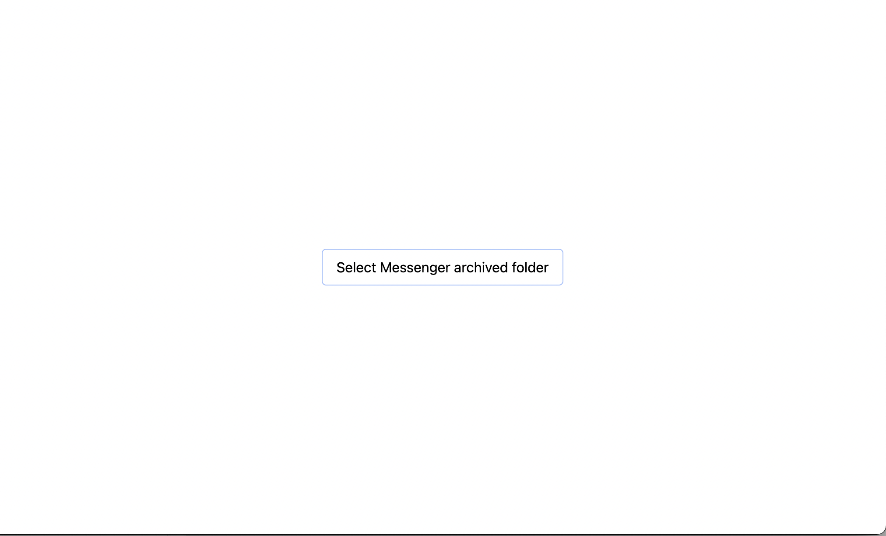
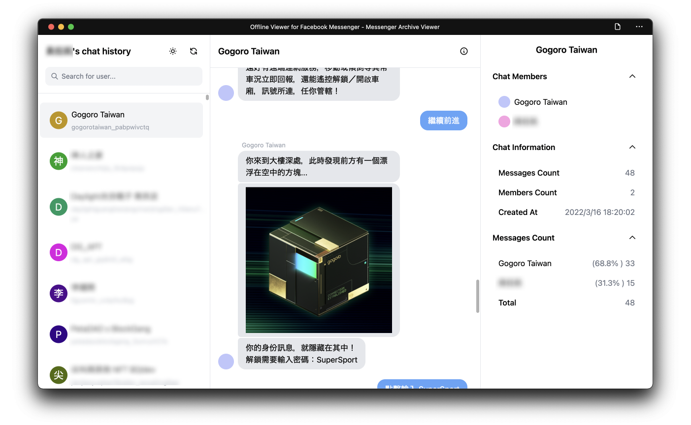
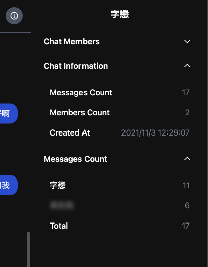
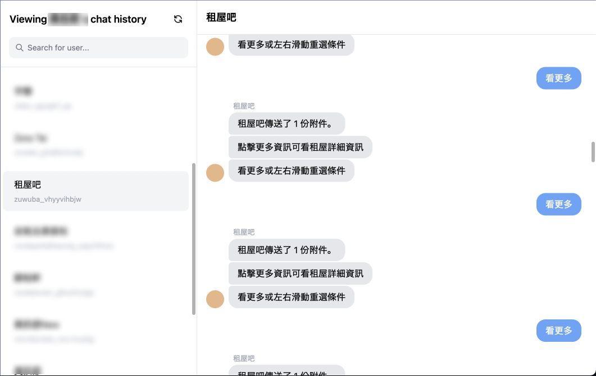

# Facebook Messenger exported JSON viewer

  <figure>
    
    <figcaption><small>Icon is made with <a href="https://heroicons.com/">Heroicons</a></small></figcaption>
  </figure>

## What's this?

This is a simple tool to view Facebook Messenger exported JSON files. I made the UI into a Messenger clone, just for fun and to see what Tailwind CSS can do. Another reason is that I want to try out the [File System Access API](https://developer.mozilla.org/en-US/docs/Web/API/File_System_Access_API), knowing that it can be used to access the file in a folder just in the browser.

### Technical Stack

- Next.JS + TailwindCSS
- [File System Access API](https://developer.mozilla.org/en-US/docs/Web/API/File_System_Access_API)

## How to use

1. Open [the Tool](https://messenger-json-viewer.vercel.app/)
2. Click the Button and select the folder you [downloaded from Meta](https://www.remote.tools/remote-work/download-facebook-messenger-conversation).
   
   > The contents of the folder should look like this
   > 
3. Wait a few seconds, sometimes it takes one minute to load.
4. Tada!
   

## Features

### Simple statistic

### Choose chatroom just as what you can do on Messenger

## TODOs

- [x] Image type message
- [x] Link
- [x] Reactions
- [x] Stickers
- [ ] Subscribe/Unsubscribe events
- [ ] Attachments
- [ ] Photos View
- [ ] Calendar to jump to specific date
- Date
  - [x] Sent at for each message
  - [ ] Date/Time separator
- Info Panel
  - Statistic
    - [x] message count (from both side)
  
## Previous works

- <https://github.com/simonwongwong/Facebook-Messenger-JSON-viewer>

## 其它

翻閱數年前的訊息實在是不忍直視......
